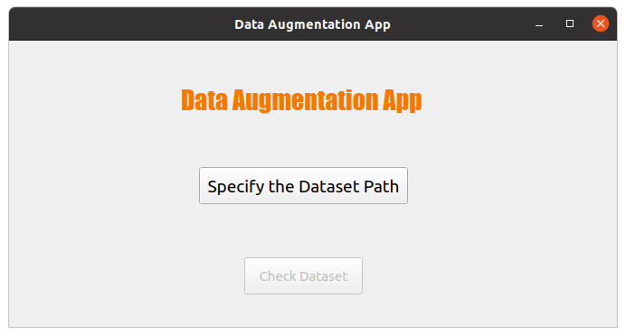
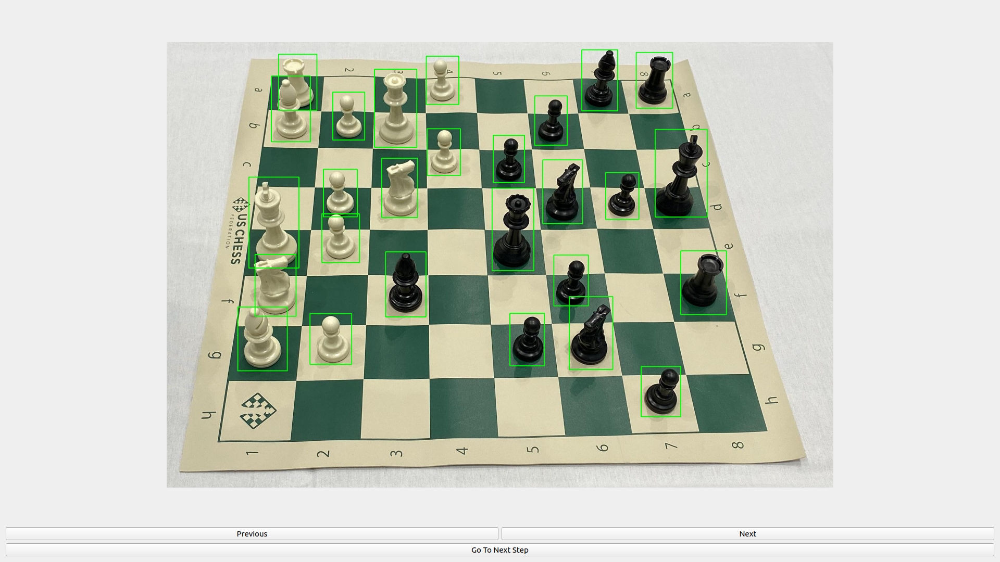
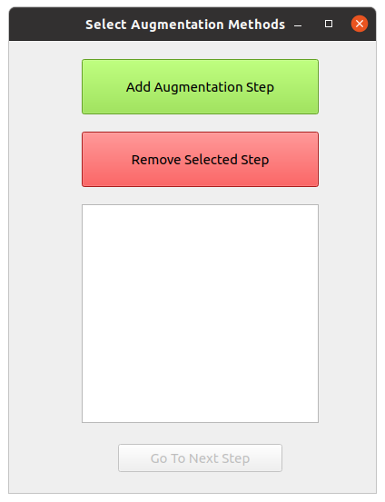
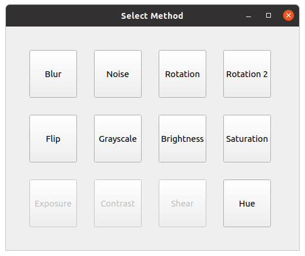
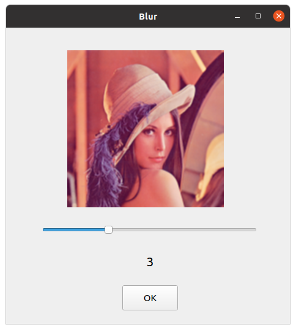
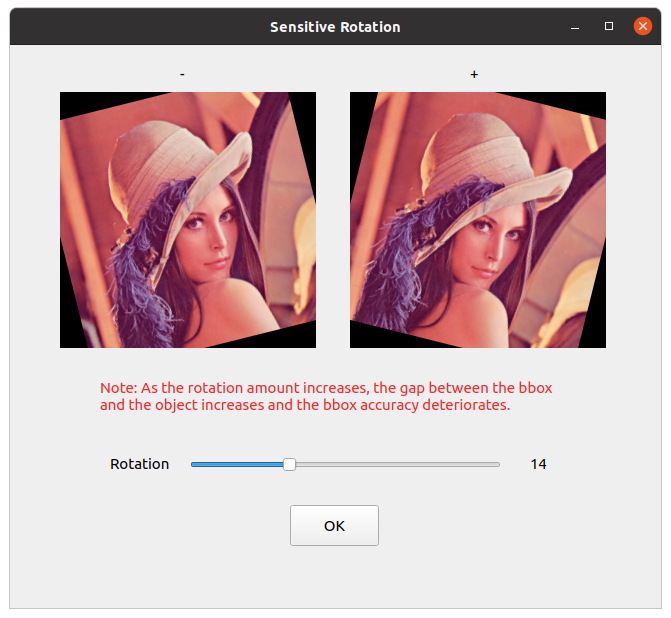
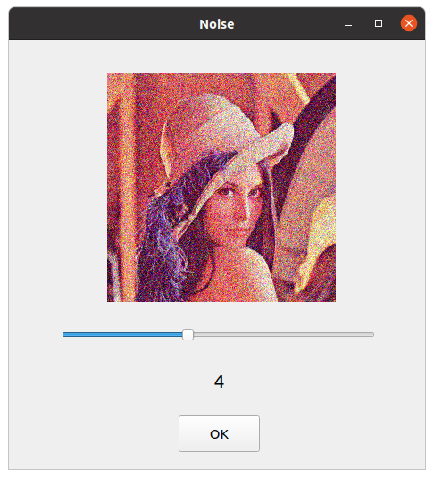
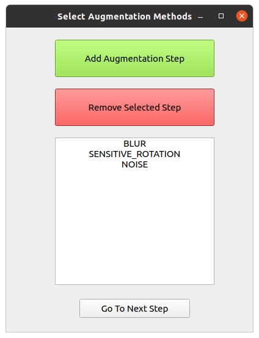
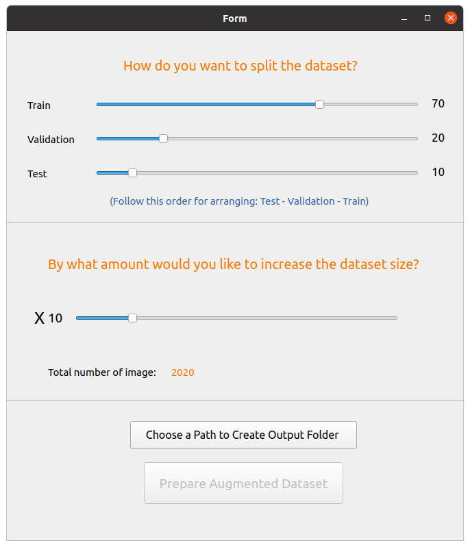

# Data-Augmentation
Bu projede Data Augmentation için PyQt uygulaması geliştirdim.

## Kullanım:
`Projeyi klonlayın` 
`PyQt5, OpenCV gibi gerekliliklerin kurulu olduğundan emin olun.` 
`main_code.py dosyasını çalıştırın.`

 
İşte bu kadar!
 

### Açılış Sayfası:
İşlenecek dataseti seçip anotasyon dosyalarının eksik olup olmadığını kontrol edin.

### Veriseti Görüntüleme Sayfası:
İşlemlere başlamadan önce verisetinizi gözden geçirin.

### Augmentation Metotları Düzenleme Sayfası:
Bu sayfada augmentation metotlarını ekleyebilir veya silebilirsiniz.

### Augmentation Metotları Seçim Sayfası:
Bu sayfada çeşitli metotları seçip parametre ayarlamaları yapabilirsiniz.

### Örnek Blur Ayarlama Sayfası:
Bu ekranda Blur sayfası örneğini görüyoruz. 

### Örnek-2 Sensitive-Rotation Ayarlama Sayfası:
Bu ekranda Sensitive-Rotation sayfası örneğini görüyoruz.

### Örnek-3 Noise Ayarlama Sayfası:
Bu ekranda Noise sayfası örneğini görüyoruz.

 
### Seçilenlere Tekrar Göz Atalım :
Bu ekranda Noise sayfası örneğini görüyoruz.

 
### Çıktı Boyutunu ve Train-Test-Val Oranını Belirleme Sayfası :
Bu sayfada çıktı olarak ne kadar veri oluşturulacağını ve train-validation-test oranını belirliyoruz. Ayrıca çıktı klasörünün nerede oluşturulacağını seçiyoruz.

Ardından `Prepare Augmented Dataset` tuşuna basıyoruz ve işlemler tamamlanana kadar bekliyoruz.

